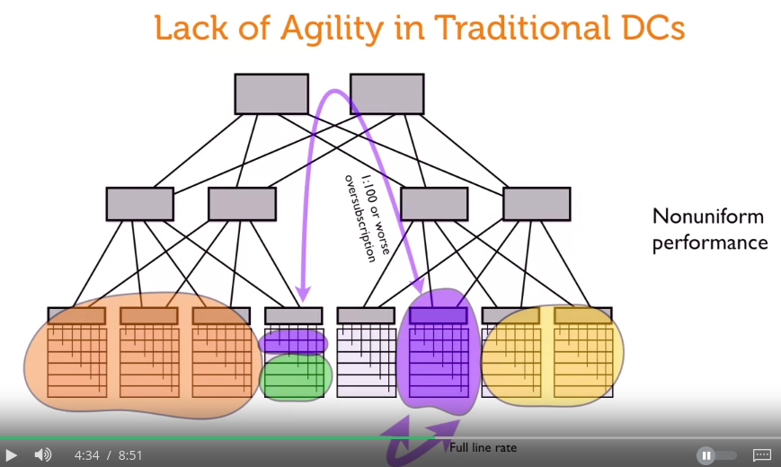

# traditional DCs problem

one problem of traditional design is: the lack of scalability.

when an application want to scale out of this original node, for example, horizontally scale to another node in different rack. Then it will result in bad communication between nodes 

