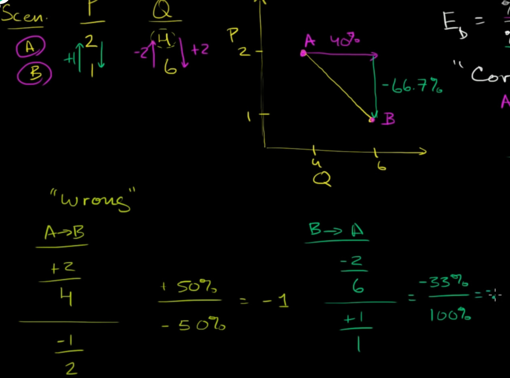

price elasticity of demand is to estimated how demand change affect the price

in short: 
- more demand -> less elasticity
- more price -> less elasticity

when calculate Elasticity, we always take percentage of **average** value between A and B, because going from A -> B is return different result than B -> A

  
