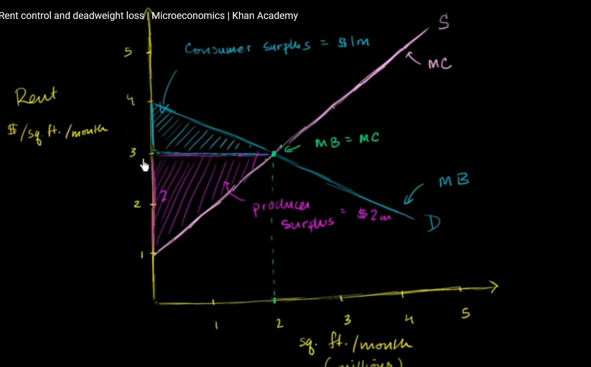
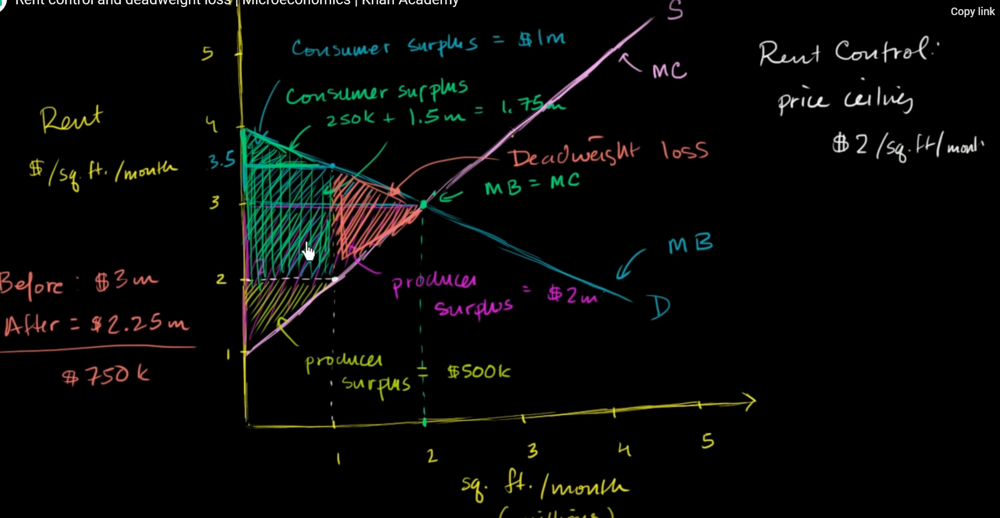
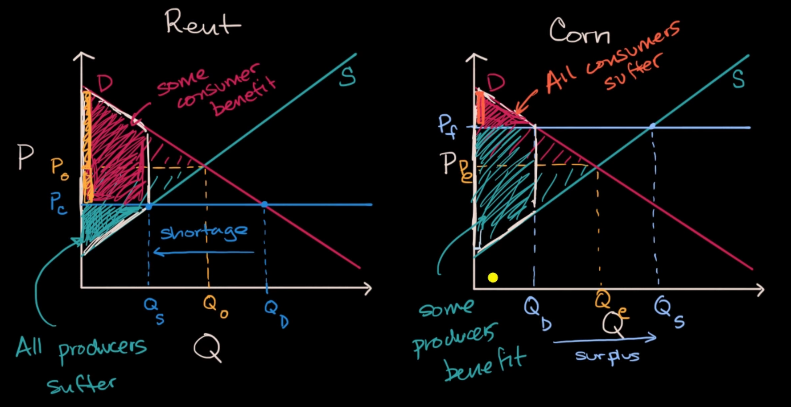

consume a model of MB and MC below

assume that the government put a ceiling on house price, maximum at 2$, so the maximum producer surplus is reduced, but consumer surplus curve is unchanged (because the desire of housing can not be changed), so we caught a loss at total surplus, which is called **deadweight loss**

# how price control reallocate surplus

putting a limit on consumer surplus or producer surplus may cause loss on total market

- ceiling rent price may lead to shortage in housing, when landlords do not want to rent their house at that low price
- this also true for flooring sell price, this will reduce consumer surplus, which may lead to surplus in supply

