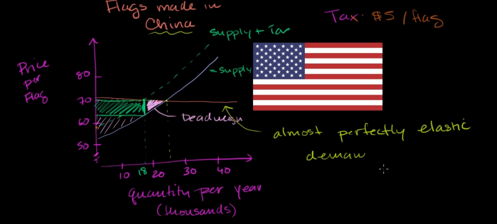

# consider products come from China, which has much lower price than US

we can have a nearly perfect elasticity of demand for flag made in china because they are much cheaper than flag made from US (because of nearly perfect elasticity, the price won't affect the price much)

so when the government put the tax on them, the price can grow a little, but do not affect much to marginal benefit

so in this case, the producers have to carry the tax burden

