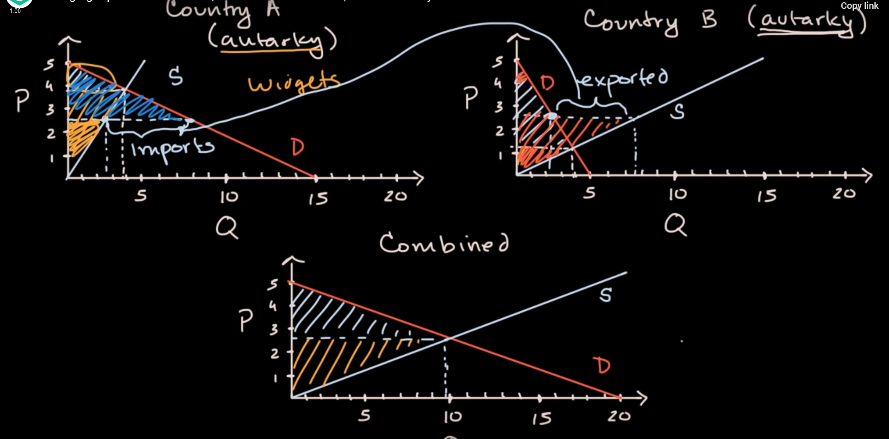
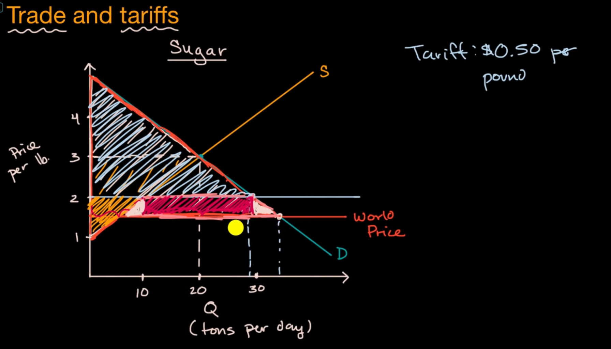

considering two countries, when they trading with each other, the consumer from country A will gain benefit, and also the producer from country B

then the producer from country A will lose their advantage, then also buyer from country B

# taxing on trade

when word price is lower than equilibrium price, the domestic producers have to suffer a lots

so that when the government putting some tax on import products, which may cause world price go up, but it will lead to deadweight loss on import total revenue

