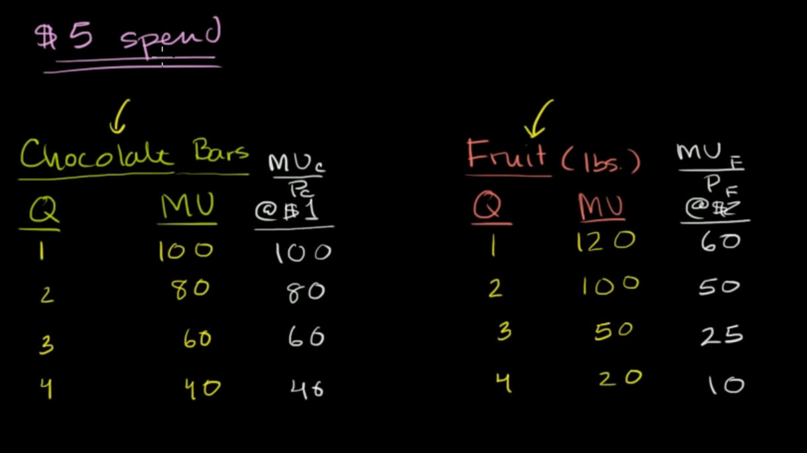
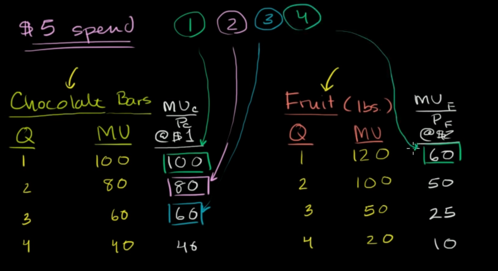
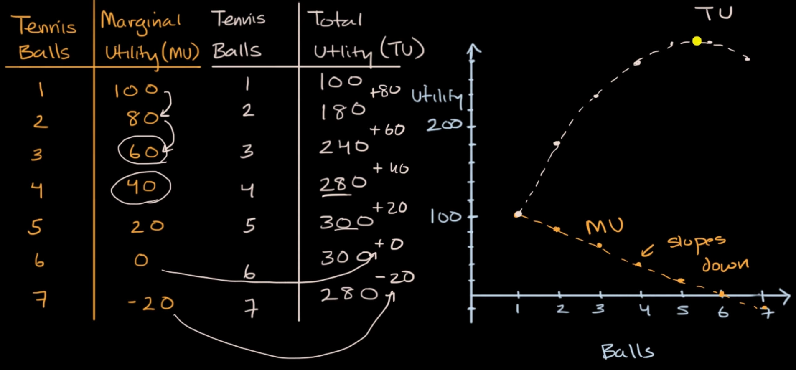

consider two type of good, chocolate and fruit

chocolate 1$ per bar, fruit 2$ per pound

we can have a marginal utility point like the table below:

**marginal utility** is to estimate how spending on a thing bring us more benefit (how many marginal utility points per dollar spent)

so we can optimize our money spending by maximizing our marginal utility

# Total utility function

