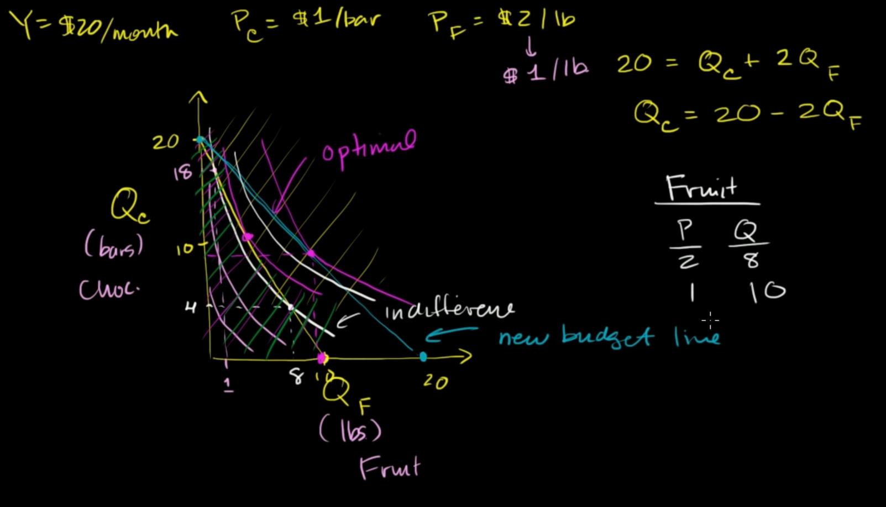
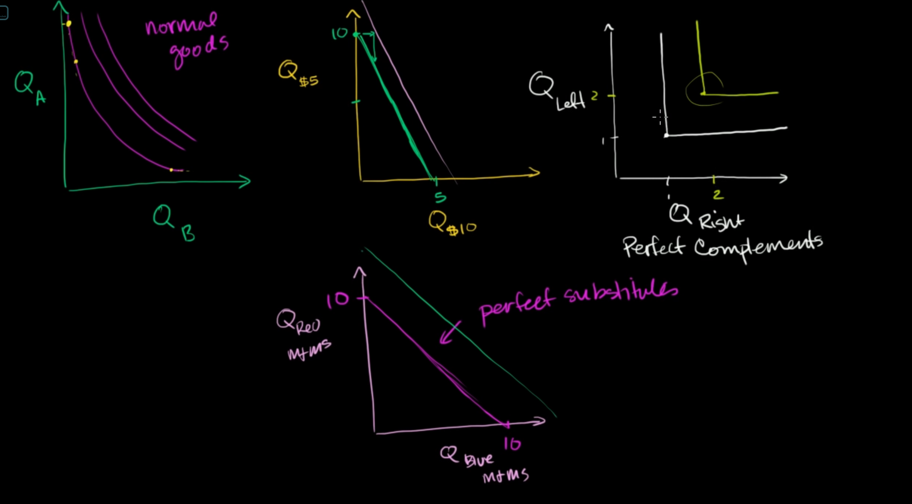

# indifferent curve

# optimal point of budget line

when a different curve has exactly one intersect with budget line, they create **optimal point**

# type of indifferent curve

3 types of indifferent curve
- normal goods
- perfect substitute (read cap and blue cap)
- perfect compliments (e.g: a pair of shoes)

