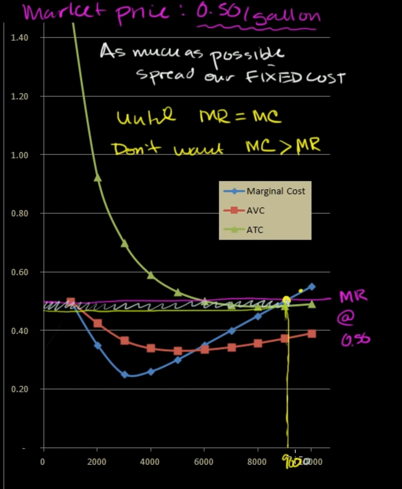
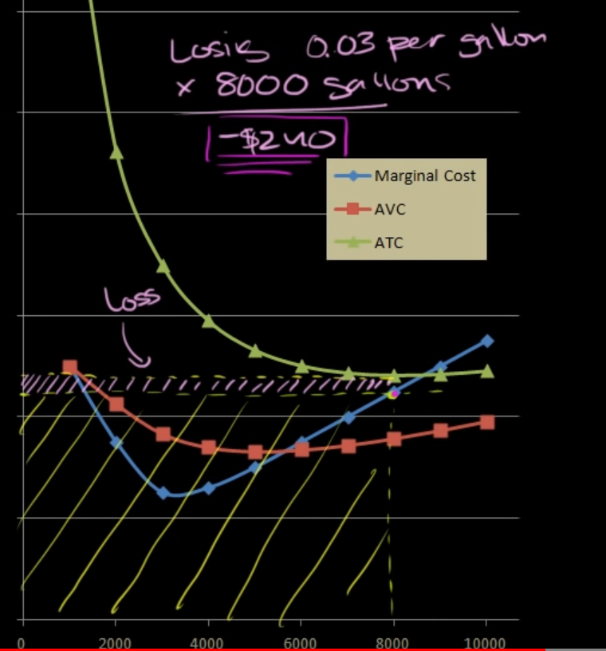

on market, considering one product, we have to get marginal cost less than market price to get profit

but on some occasion, when marginal cost even larger than market price, we still have to produce and sell, to avoid losing fixed cost

consider the market price at 0.45, and marginal cost is 0.50, so if we sell 8000 products, we will get the loss at 240$, but on comparing to the fixed cost of 1000$, this is much better

