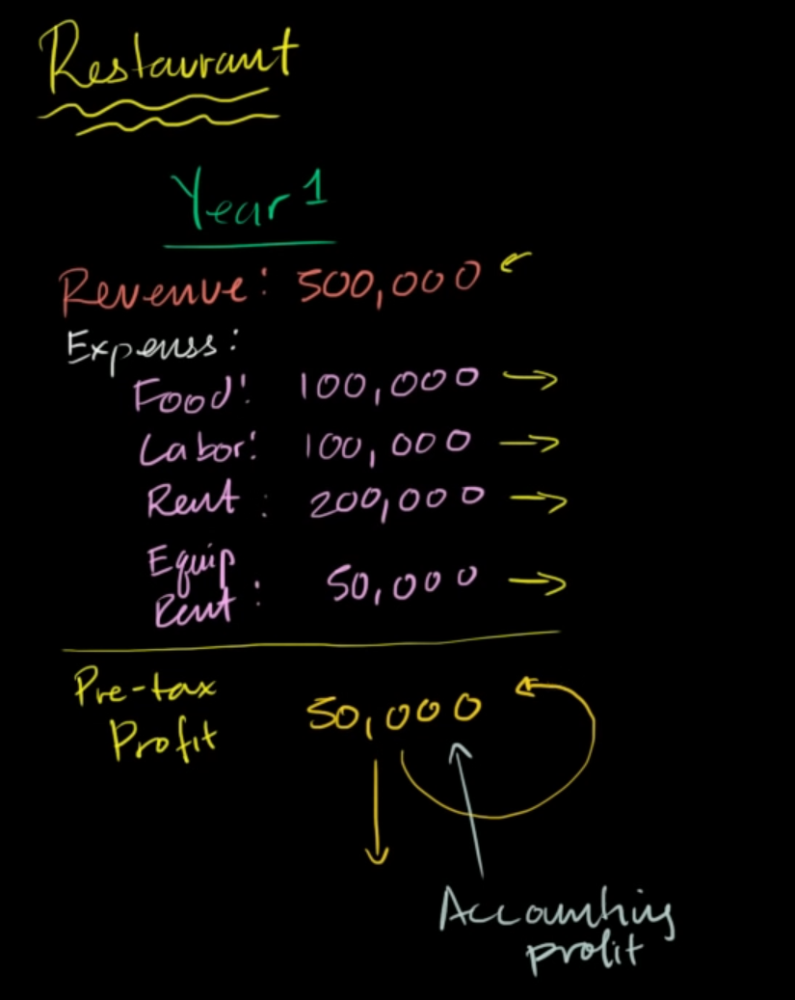
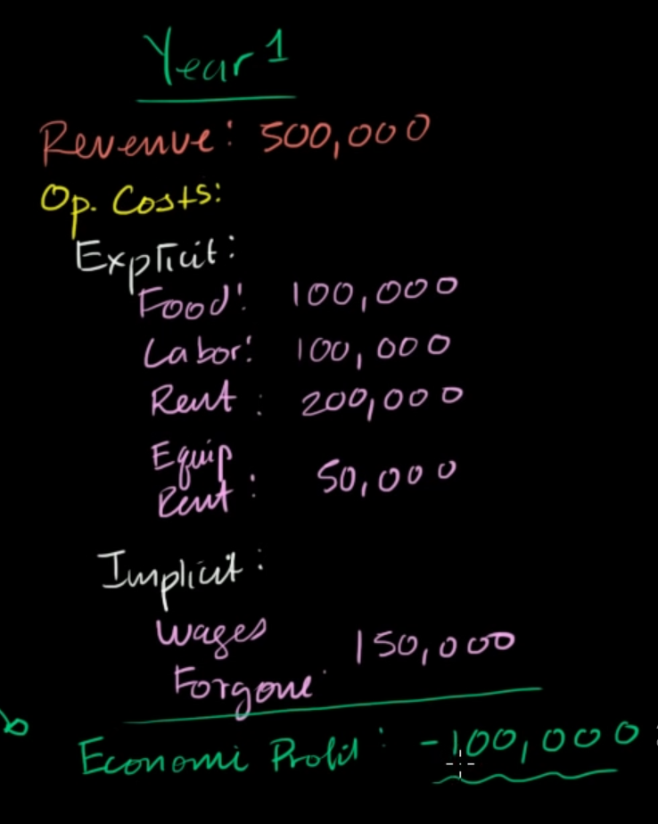
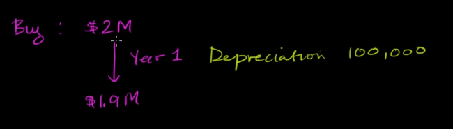
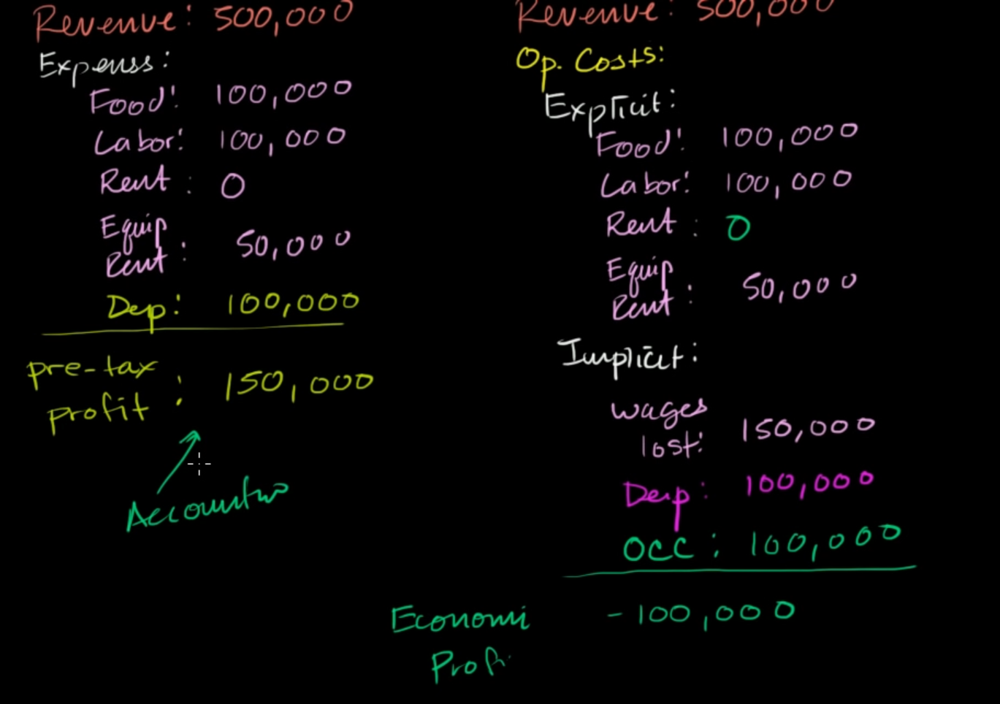

# possibility cost

assume that you are running a restaurant. Your expenses are like below:

for accounting profit, you still have 50k$ of profit, but for economics point of view, assume that you spend your all time to focus on managing that business, your wages is the opportunity cost:

# capital depreciation

consider you own that building and do not spend money for renting, but you still loss an amount of money which is the market price of your own building. Assume that after 1 year your restaurant in operation, you loss 100k$ for the value of that building. this is the depreciation of capitals

