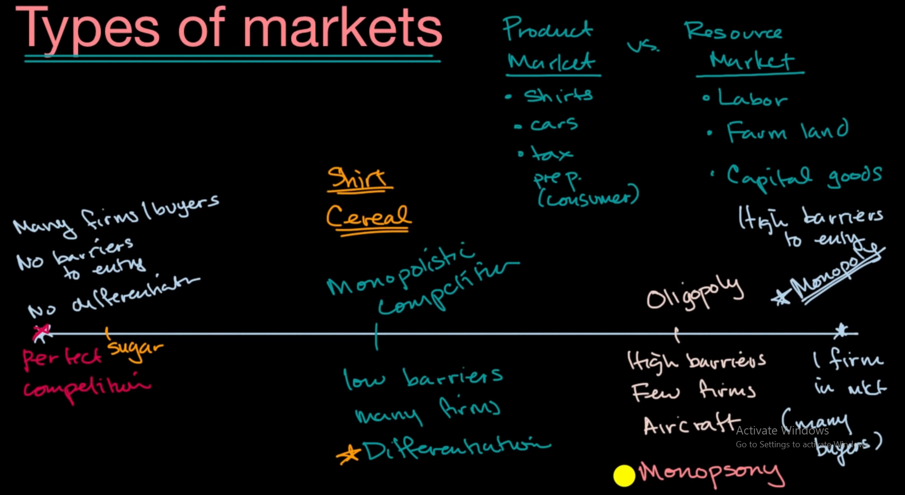
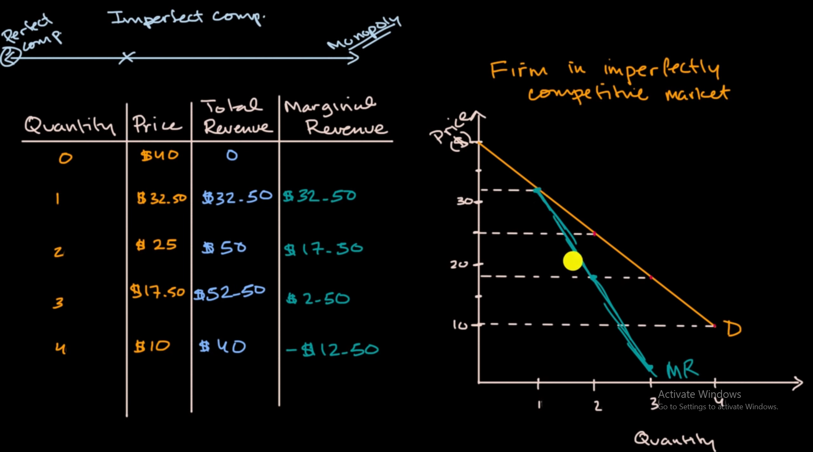

base on monopoly characteristic, we have different type of markets

# imperfect competitive market and its marginal revenue

on an imperfect competitive market, firm's production determine it's price

for example, for Nike sneaker, no other can compete in producing Nike shoes except for Nike, so the price for a project depend totaly on its quantity

