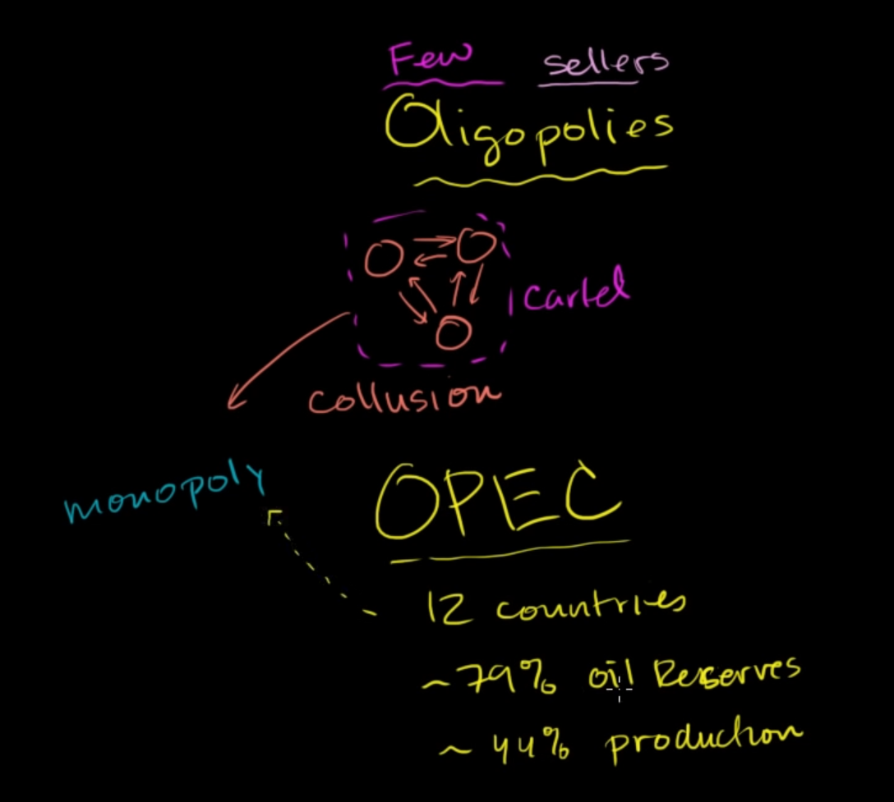

# oligopoly is a small group of producer that dominate the market (near like monopoly)

if they coordinate with each other, for example, aggree that produce at some amount to keep the price high, they form a cartel

for example, OPEC is a cartel that they dominate the market of oil, and they can control oil price to whatever they want 

