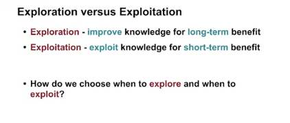
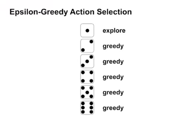
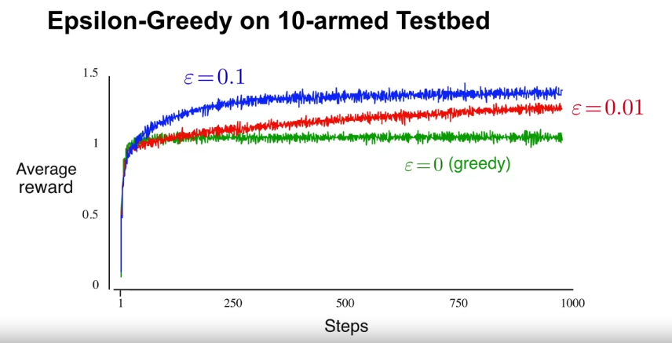

# exploration and exploitation, epsilon-greedy method

we declare a new parameter called **epsilon** to balance between exploration and exploitation

**epsilon-greedy** is the probability for considering between exploration and exploitation, the idea is that we roll a dice with 1/6 of exploring and 5/6 of greedy before each run

and the result is much better

