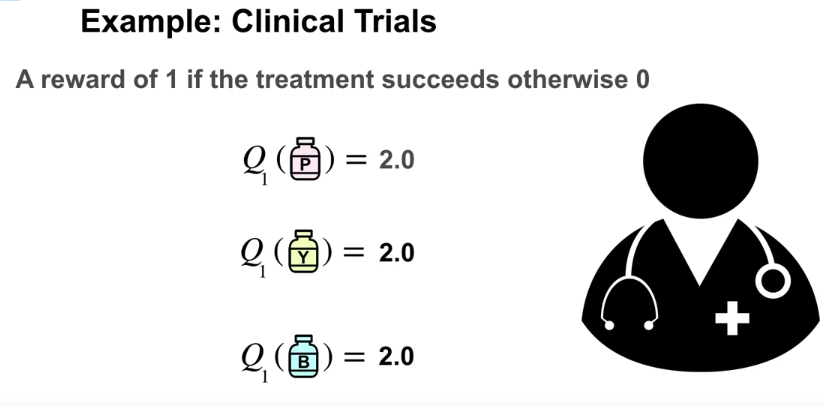
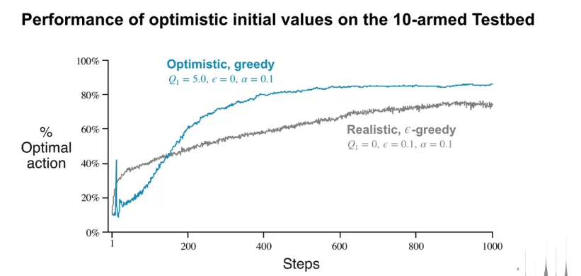

the idea of optimistic initially value is that for each choice, we init a high result, 2, for example (our decision is between 0 and 1). This idea allow each choice to fail some times, so this allow more exploration in early. And then focus on greedy later

In early, this method can be worse, because it keep exploring but not optimizing the reward, but in the long run this result much better

