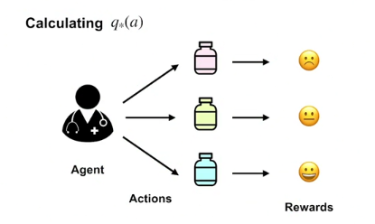
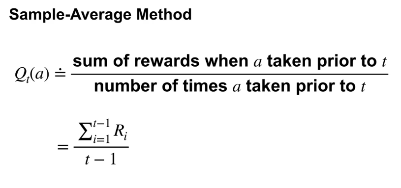
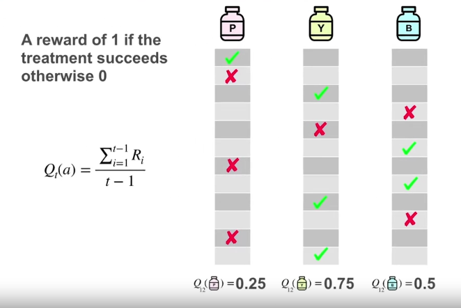
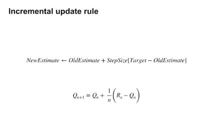
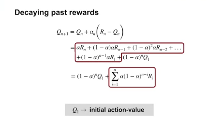

# k-armed bandit problem 
is when you are given k decisions coming as sequence to choose and get the reward from them. you have to maximize your reward

# action-values

### sample-average method
take average of result set to consider which decision is better

then you can choose the highest average

# action-values incrementally

the idea of this evaluating is get contributions from all the previous estimated rewards

full formula:

