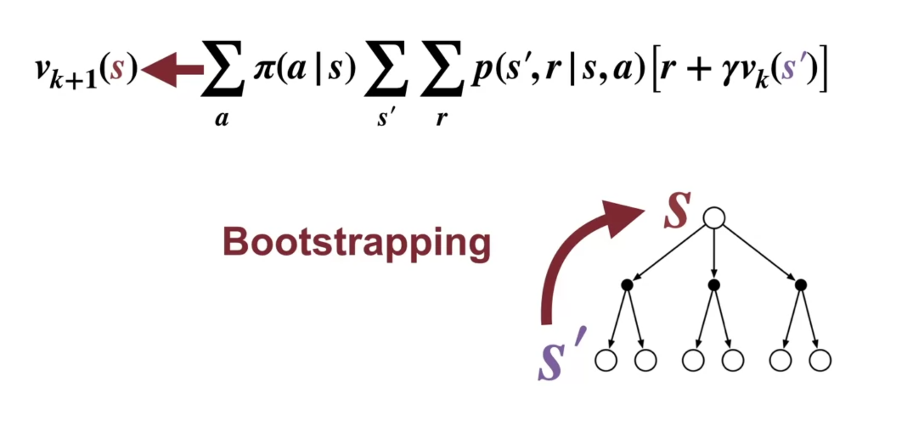

# instead of fully gready policy optimization, we can "relax" this process

# pseudo code

### instead of full sweeping through all the states, we can add randomness to updates, which is called "asynchronous DP"

# bootstraping

instead of finishing all sucessor states, we can use just one or some layer after, without computing all, to update our current state

this is an alternative way for policy iteration

