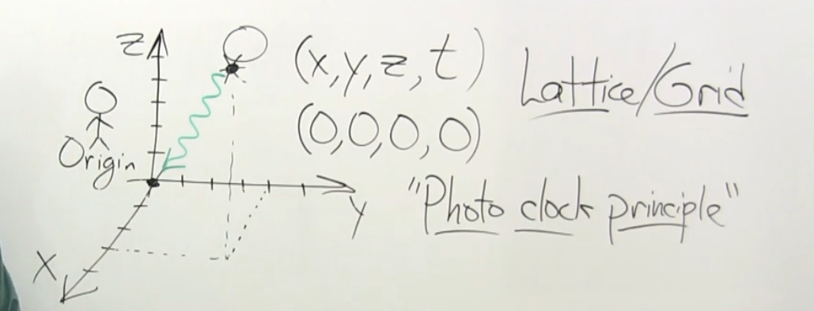

in a point of 3d space, an event has its own x, y, z and t

every single point in the space can have its clock

when the light come from an event, record the clock, take a picture, thats called observe an event

